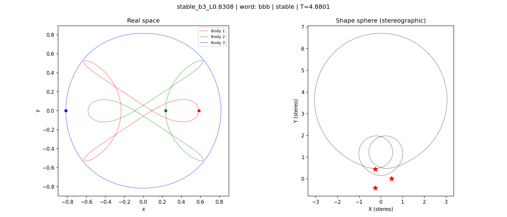
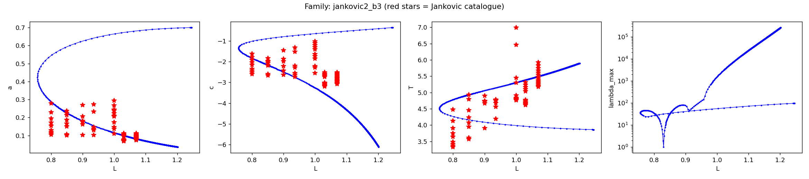
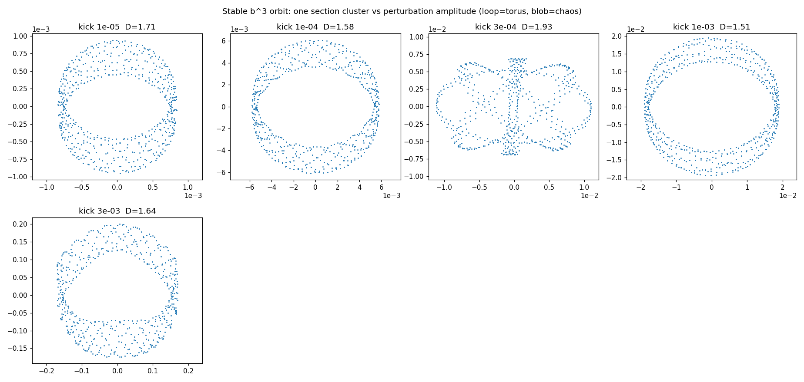

# A linearly stable three-body orbit at non-zero angular momentum

**Summary.** Numerical continuation in the BHH (Jankovic) parameter space turns
up what appears to be a **linearly stable periodic orbit of the equal-mass
three-body problem at non-zero angular momentum** — a `b³` orbit, stable in a
narrow window around `L = 0.83`. Every linearly stable equal-mass orbit
documented in the literature so far sits at **zero** angular momentum (the
figure-eight, Schubart, S-orbit and Broucke families, and the ~971 in Hristov,
Hristova & Tanikawa, *New Astronomy* 125, 2026). A stable one at `L ≠ 0` would
be the first.

*Real-space trajectory (left) and shape-sphere stereographic projection (right).
The shape curve winds around a single collision puncture three times — free
group word `bbb`.*

## The orbit

| quantity | value |
|---|---|
| parametrisation | BHH (Jacobi), fixed `L` |
| `a` | 0.246486 |
| `c` | −2.035290 |
| `L` (angular momentum) | 0.8308 |
| `T` (period) | 4.880107 |
| `E` (energy) | −1.5766 |
| free group word | `b³` |
| stable window | `L ∈ [0.83050, 0.83095]` |

It was found not by a grid scan but by **pseudo-arclength continuation** of the
Jankovic #2 family — tracing the family as a curve in `(a, c, T, L)` and
watching its Floquet multipliers. No grid scan visited these parameters.

## Why it looks real, and where it lives

The figure below traces the whole #2 family. The left three panels show it
folding back at **`L ≈ 0.757`** — that fold is the family's *minimum* angular
momentum, so the family **never reaches the symmetric `L = 0` plane**. The
right panel shows the largest Floquet multiplier dipping all the way to **1 at
`L ≈ 0.83`** (the stable window) before climbing again.

*The b³ family in `(L, a)`, `(L, c)`, `(L, T)` and `(L, λ_max)`. Red stars are
Jankovic catalogue orbits. Note the fold near `L = 0.76` and the sharp dip of
`λ_max` to 1 near `L = 0.83`.*

The disconnection from `L = 0` is the interesting part: the stability is **not
inherited** by continuing a known stable `L = 0` orbit upward — the family has
no `L = 0` ancestor at all. The stability is *created* inside the `L ≠ 0`
regime. (Hristov et al. 2026 explicitly propose continuing a stable `L = 0`
orbit up in `L` as future work; this orbit occupies that gap, but from the
other side — it exists only away from `L = 0`.)

## Stability evidence

**Linear.** Inside the window all twelve Floquet multipliers lie on the unit
circle. The window is bounded below and above by **Krein collisions** (a
complex multiplier pair colliding and leaving the circle; the upper one at
`L ≈ 0.83097`, with the two colliding multipliers carrying *opposite* Krein
signature, the condition for ejection). A separate **period-doubling**
bifurcation (a real multiplier through −1) sits just above at `L = 0.83106`.

The `λ = 1` claim is the fragile part numerically, so it has been pressure
tested:

- **Integrator/tolerance independence.** Recomputing the monodromy across four
  integrators (DOP853, Radau, LSODA, RK45) and three tolerances gives
  `λ_max ∈ [1.0000000, 1.0000016]` with zero unstable multipliers every time,
  while a known-unstable neighbour is robustly flagged (`λ_max = 1.991`). The
  verdict is not an artifact of one integrator.
- **Arbitrary-precision check.** Recomputing the monodromy in 35-digit
  arithmetic (mpmath) places the four *physical* multiplier pairs on the unit
  circle to **5×10⁻¹³** (‖λ‖−1 between 6×10⁻¹⁴ and 5×10⁻¹³) — about seven
  orders below the double-precision floor. The trivial `+1` multipliers from the
  orbit's symmetries form a defective Jordan block whose numerical splitting
  scales as the *square root* of the matrix error (here √(3×10⁻¹³) ≈ 5×10⁻⁷, the
  observed split) and is not a physical instability.

**Nonlinear.** A Poincaré surface of section through the orbit shows small
perturbations tracing clean nested closed loops — invariant KAM tori — rather
than spreading out, with a resonance island appearing at intermediate
amplitude. A correlation-dimension estimator, calibrated on synthetic regular
and chaotic sets, puts the perturbed motion at `D ≈ 1.5–1.9` (regular) for
kicks up to ~`3×10⁻³`.

*One section cluster at increasing perturbation amplitude. Closed loops =
invariant tori (regular); the double-lobe at kick `3×10⁻⁴` is a resonance
island, itself a regular structure. Motion stays bounded out to kick ~`10⁻²`.*

## Status / caveats

The result is double-precision-validated and now arbitrary-precision-checked at
the representative point; what remains for a publication-grade claim is a
long-time (`10⁴`–`10⁶` period) shadowing test and, ideally, high-precision
Newton refinement of the orbit itself (not just the monodromy). The headline
claim is therefore stated as *"appears to be the first linearly stable orbit at
`L ≠ 0`, with strong numerical evidence of nonlinear (KAM) stability."*

## References

- Suvakov & Dmitrasinovic, *Am. J. Phys.* 82(6), 2014.
- Jankovic, Dmitrasinovic & Suvakov, *Comp. Phys. Comm.* 250, 2020.
- Li & Liao, *Sci. China Phys. Mech. Astron.* 60, 2017.
- Hristov, Hristova & Tanikawa, *New Astronomy* 125, 2026.
